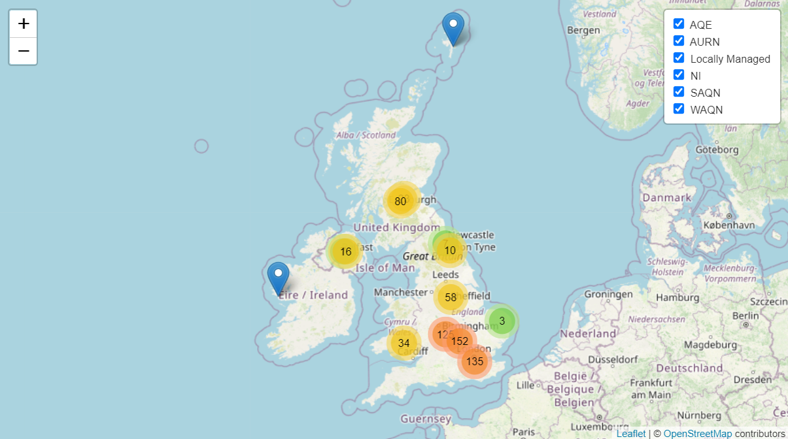
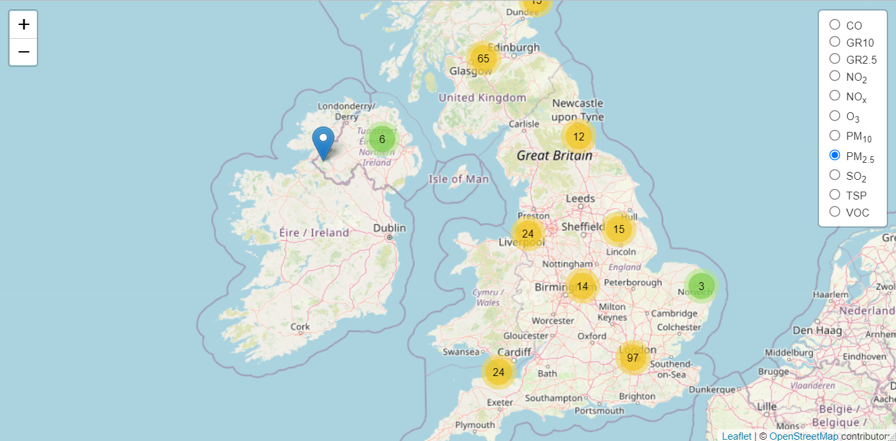
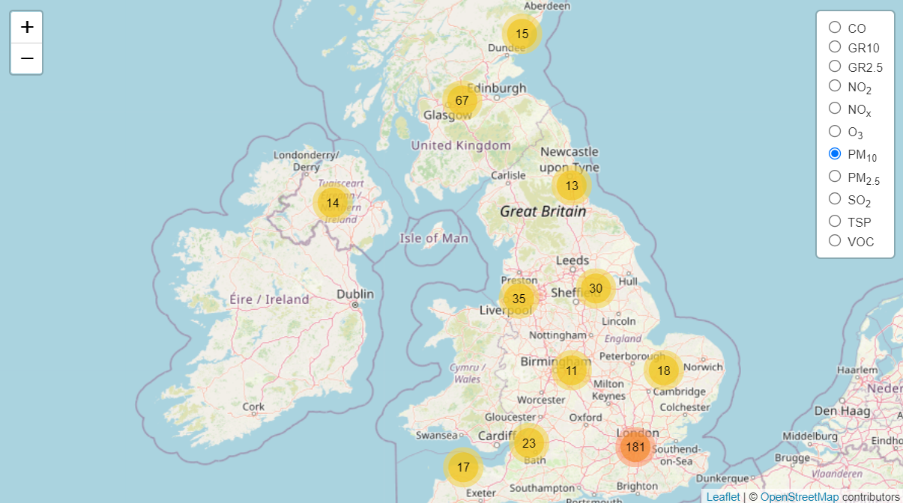

```{r}
#| echo: false

default_chunk_hook  <- knitr::knit_hooks$get("chunk")

latex_font_size <- c("Huge", "huge", "LARGE", "Large", 
                     "large", "normalsize", "small", 
                     "footnotesize", "scriptsize", "tiny")

knitr::knit_hooks$set(chunk = function(x, options) {
  x <- default_chunk_hook(x, options)
  if(options$size %in% latex_font_size) {
    paste0("\n \\", options$size, "\n\n", 
      x, 
      "\n\n \\normalsize"
    )
  } else {
    x
  }
})
```

# Introduccion

## Contaminación del Aire

Los problemas asociados a la contaminación de aire pueden estar divididos en cinco diferentes categorías, polución local, polución urbana, regional, continental y global:

-   **Contaminación Local:**\
    Este tipo de contaminación esta usualmente caracterizada por uno o varios emisores que aportan una cantidad considerable de material particulado o una gran cantidad de emisores relativamente pequeños. Adicionalmente, existen fuentes emisoras como el \ce{CO} proveniente de la combustión de los vehículos o los subproductos de la generación de compuestos orgánicos volátiles provenientes del tratamiento de residuos serán una gran fuente de emisión.[@Boubel1994]

-   **Contaminación Urbana:**\
    Generalmente la contaminación de aire en las zonas urbanas se da de dos maneras; en la primera por la liberación de contaminantes primarios los cuales provienen directamente de fuentes, mientras que en la segunda se da por la formación de reacciones químicas de los contaminantes primarios. La mayoría de los contaminantes urbanos son relativamente no reactivos como el monoxido de carbono y el material particulado, o de especies de baja reactividad como los dióxidos de sulfuro.[@Boubel1994]

-   **Contaminación Regional:**\
    Esta se da por la existencia de grandes urbes, el aire cercano a estas ciudades contiene gran cantidad de contaminantes primarios y contaminantes provenientes de reacciones químicas. De igual manera existen contaminantes que permanecen en el tiempo, reaccionan y se transforman durante el tiempo. Este es el caso del \ce{SO2} el cual es liberado principalmente a través la combustión de combustibles como el carbón o el petróleo, el \ce{SO2} se oxida a \ce{SO3}, que reacciona con el vapor de agua para formar \ce{H2SO4} el cual reacciona con numerosos compuestos para formar sulfatos. Por ejemplo \ce{NO} resulta de la combustión a alta temperatura, en centrales eléctricas o plantas industriales en la producción.[@Boubel1994]

-   **Contaminación Continental y Global :\
    **Respecto a la contaminación continental no existe una diferencia respecto a nivel regional, sin embargo, se debe tener en cuenta que existen diferencias a nivel continental, por ejemplo existen casos como la lluvia ácida en escandinavia que ha tenido repercusiones a nivel europeo, otro claro ejemplo en paises asiaticos como Japón, Corea y China sus emisiones contaminantes son más amplias debido a su capacidad industrial. A escala global se tienen en cuenta los impactos continentales y regionales, sin embargo siempre han existido eventos de impacto mundial como el accidente de Chernobyl donde se detectaron niveles inusuales de radiactividad en continentes como el americano, así mismo se deben tener en cuenta los problemas de contaminación a nivel global, como es el caso de clorofluorocarbonos que tiene un efecto profundo sobre la capa de ozono atmosférica, sumado a los efectos de radiación solar que es fuente energética para la generación de reacciones químicas. [@Boubel1994]

### Contaminantes

De acuerdo con el Centro de Prevencion y control de enfermedades (CDC) por sus siglas en inglés, La EPA ha identificado seis principales contaminantes basados en la salud humana y el medio ambiente. [@CDCP2023]

-   Monoxido de Carbono \ce{CO}

-   Plomo \ce{Pb}

-   Oxidos de Nitrogeno (\ce{NO2})

-   Ozono (\ce{O3})

-   Material Particulado (PM$_{10}$ y PM$_{2.5}$)

-   Dioxido de Sulfuro (\ce{SO2})

-   Acroleina (\ce{C3H4O})

-   Benzeno (\ce{C6H6})

-   Sulfuro de Carbono (\ce{CS2})

-   Asbesto

-   Queroseno/Combustibles Fosiles

-   Hidrocarburos aromáticos policíclicos (PAHs)

-   Hidrocarbonos de Petroleo totales (TPH)

-   Creosota (\ce{C7H8O2})

### Material particulado

Los peligros para la salud y morbilidad a causa de las pequeñas emisiones de material particulado (PM) como consecuencia de la ineficaz combustión de los combustibles fósiles y sólidos han sido documentados, sin embargo, no hay precedentes sobre los riesgos ambientales para la salud.[@Anilla2022]. La Organizacion mundial de la Salud en el año 2005 emitió una guia de referencia de la calidad del aire sobre contaminantes de material particulado de 2.5$\mu$m o menos(PM2.5) y 10$\mu$m la cual se basada relacion entre la exposición a altas concentraciones de material particulado (PM10 y PM2.5) y el aumento de la mortalidad o morbilidad.[@WHO2006]

De acuerdo a la Organizacion Mundial de la Salud para el 2005 el material particulado fino(PM$_{2.5}$) era en promedio de 10$\mu$g/m$^3$ anualmente lo que equivale a 25 $\mu$g/m$^3$ en un dia, mientras que el material particulado grueso (PM$_{10}$) era de 20$\mu$g/m$^3$, aproximadamente 50 $\mu$g/m$^3$. Cabe destacar que la contaminación por material particulados, aun en bajas concentraciones tiene impacto sobre la salud, en el informe anteriormente mencionado el PM$_{2.5}$ fue identificado como uno de los principales contaminantes del aire directamente relacionado con la causa de accidentes cerebrovasculares, cardiopatía isquémica; enfermedad pulmonar obstructiva crónica y cáncer de pulmón.[@WHO2006]

En el año 2015, la OMS declaro la contaminación del aire como una de las principales riesgos hacia a la salud publica, por lo que los miembros de los 194 estados miembros emitieron un informe donde se atribuía que La contaminación del aire es una de las principales causas de enfermedad y muerte en todo el mundo. Alrededor de 4,3 millones de muertes cada año, la mayoría en países en desarrollo, están asociadas con la exposición a la contaminación del aire doméstico. Otros 3,7 millones de muertes al año se atribuyen a la contaminación del aire ambiental .[@WHO2015]

Los principales contaminantes del aire son producto de las actividades diarias en las cuales se incluyen: la producción de energías primarias, los sistemas de transporte el desarrollo urbano, añadiendo que el desarrollo industrial y los subproductos de la combustión junto a las incineraciones no controladas presentan un gran impacto sobre la calidad del aire. [@WHO2015]

<!-- ### Material Particulado 2.5 -->

<!-- Los PM en entornos urbanos y no urbanos es una mezcla compleja con componentes que tienen diversas características químicas y físicas. La investigación sobre PM y la interpretación de los resultados de la investigación sobre exposición y riesgo se complican por esta heterogeneidad y la posibilidad de que el potencial de las partículas para causar lesiones varía con el tamaño y otras características físicas, composición química y de la fuente.  Diferentes características de PM pueden ser relevantes para diferentes efectos sobre la salud. Los hallazgos de investigaciones más recientes continúan destacando esta complejidad y la naturaleza dinámica de las partículas suspendidas en el aire, ya que se forman de forma primaria o secundaria y luego continúan experimentando transformaciones químicas y físicas en la atmósfera.[@WHO2021] -->

<!-- No obstante, las partículas todavía se clasifican generalmente por sus propiedades aerodinámicas, porque éstas determinan los procesos de transporte y eliminación en el aire y los sitios de deposición y las vías de eliminación dentro del tracto respiratorio. El diámetro aerodinámico se utiliza como indicador resumen del tamaño de las partículas; el diámetro aerodinámico corresponde al tamaño de una esfera de densidad unitaria con las mismas características aerodinámicas que la partícula de interés. Las diferencias en las propiedades aerodinámicas entre las partículas son aprovechadas por muchas técnicas de muestreo de partículas (Oficina Regional de la OMS para Europa, 2006) -->

<!-- En las últimas décadas, la atención se ha centrado en las partículas con diámetros aerodinámicos inferiores o iguales a 2,5 µm (PM2,5) o 10 µm (PM10). -->

<!-- ### **Necesidad de los modelado del aire** -->

<!-- La necesidad de modelos -->

<!-- Los modelos proporcionan un medio para representar un sistema real de una manera comprensible. Toman muchas formas, comenzando con "modelos conceptuales" que explican la forma en que funciona un sistema, como la descripción de todos los factores y parámetros de cómo se mueve una partícula en la atmósfera después de su liberación de una planta de energía. -->

<!-- Los modelos conceptuales ayudan a identificar las principales influencias sobre dónde es probable que se encuentre una sustancia química en el medio ambiente y, como tal, deben desarrollarse para ayudar a identificar las fuentes de datos necesarias para evaluar un problema ambiental. -->

<!-- En general, desarrollar un modelo de contaminación del aire requiere dos pasos principales. -->

<!-- Primero, se debe definir un modelo del dominio y los procesos que se están estudiando. Luego, en los límites del modelo, se necesita especialmente un modelo de las condiciones de contorno para representar el entorno influyente que rodea el dominio de estudio. La calidad del estudio modelo está relacionada con la precisión y representatividad del estudio real.[@Vallero2008] -->

\

# Modelado Geoestadistico

## Descripcion de la Zona

La base de datos seleccionada para este trabajo proviene del departamento de Medio Ambiente, Alimentación y Asuntos Rurales del Reino unido,de la cual se extrae [datos](https://uk-air.defra.gov.uk/data/) de la fuente de informacion del Reino Unido.

El reino unido mediante su agencia ambiental posee alrededor de 300 sitios de monitoreo ambiental los cuales se subdividen en redes que adquieren informacion particular de acuerdo al contaminante. Existen dos tipos de [redes de monitoreo](https://uk-air.defra.gov.uk/networks/) en el reino unido:

1.  [**Redes automaticas:**](https://uk-air.defra.gov.uk/networks/network-info?view=automatic) estas permiten la captura de datos de contaminantes que se producen por hora. La recopilación de datos comprende datos desde 1972 para algunos sitios:

    -   [Automatic Urban and Rural Network (AURN)](https://uk-air.defra.gov.uk/networks/network-info?view=aurn)
    -   [Automatic Hydrocarbon Network (AHN)](https://uk-air.defra.gov.uk/networks/network-info?view=hc)
    -   [Automatic London Network](https://uk-air.defra.gov.uk/networks/network-info?view=aln)
    -   [Locally-managed automatic monitoring](https://uk-air.defra.gov.uk/networks/network-info?view=nondefraaqmon)

2.  [**Redes no automaticas:**](https://uk-air.defra.gov.uk/networks/network-info?view=automatic) La recopilacion de los datos se da para contaminantes que se producen con menor frecuencia (diaria,semanal, mensual) donde las muestras son recopiladas por medios físicos y son sometidas a análisis fisico-quimico que permite calcular la concentración de los resultados, a continuación se relacionan las redes de monitoreo para esta categoría:

    -   [UK Eutrophying & Acidifying Network (UKEAP)](https://uk-air.defra.gov.uk/networks/network-info?view=ukeap)
    -   [Upland Waters Monitoring Network](https://uk-air.defra.gov.uk/networks/network-info?view=uw)
    -   [Heavy Metals Network](https://uk-air.defra.gov.uk/networks/network-info?view=metals)
    -   [Nitrogen Dioxide Diffusion Tube (1993 to 2005)](https://uk-air.defra.gov.uk/networks/network-info?view=no2old)
    -   [Smoke and Sulphur Dioxide](https://uk-air.defra.gov.uk/networks/network-info?view=smsites)
    -   [Black Carbon Network](https://uk-air.defra.gov.uk/networks/network-info?view=ukbsn)
    -   [PAH](https://uk-air.defra.gov.uk/networks/network-info?view=pah)
    -   [Toxic Organic Micro Pollutants (TOMPs)](https://uk-air.defra.gov.uk/networks/network-info?view=tomps)
    -   [Non-Automatic Hydrocarbon Network](https://uk-air.defra.gov.uk/networks/network-info?view=nahc)
    -   [Particle Numbers and Concentrations Network](https://uk-air.defra.gov.uk/networks/network-info?view=particle)
    -   [JAQU privacy notice](https://uk-air.defra.gov.uk/library/no2ten/privacy-notice)
    -   [UK Urban NO2 Network](https://uk-air.defra.gov.uk/library/no2ten/privacy-notice)

Dentro de los enlaces relacionados se puede recopilar la información disponible para cada red.

El gobierno del Reino Unido permite la extracción, analisis e interpretacion de los datos de codigo abierto y libre mediante el uso del paquete [`Openair`](https://uk-air.defra.gov.uk/data/openair) usando R. Para la adecuación de los datos se realiza el procedimiento descrito en <https://rspatialdata.github.io/air_pollution.html#Installing_the_openair_packageR> mediante la integracion del paquete `tidyverse`.

Para la extracción de los datos se verifican algunas de las redes de monitoreo existentes en el año 2021- 2022, como se muestra en la siguiente codigo ejecutado en R:

```{r}
#| eval: false
install.packages("openair")
install.packages("openairmaps")
library(openair)
library(openairmaps)
networkMap(
    source = c("aurn","saqn","waqn","ni", "aqe", "local"),
    control = "network",
    year = 2021:2022,
    cluster = TRUE,
    provider = "OpenStreetMap",
    collapse.control = FALSE
)
```

{fig-align="center" width="10.8cm"}

Posterior se escogen las variables PM$_{2.5}$ y PM$_{10}$ y se verifican sus redes de monitoreo:

```{r}
#| eval: false
networkMap(
    source = c("aurn","saqn","waqn","ni", "aqe", "local"),
    control = "variable",
    year = 2021:2022,
    cluster = TRUE,
    provider = "OpenStreetMap",
    collapse.control = FALSE
)
```

::: {#fig-elephants layout-ncol="2"}
{#fig-PM25 fig-align="center" width="8cm" height="5cm"}

{#fig-PM10 fig-align="center" width="8cm" height="3.5cm"}

Mapa de material particulado en el Reino Unido
:::

Con base en lo anterior se ejecuta el código para la extracción de los datos diarios de los contaminantes mencionados, se guarda en un data frame y se exporta como CSV:

```{r}
#| eval: false
#| echo: true
importAURN()
importSAQN()
importWAQN()
importAQE()
importNI()
importLocal()

meta_data <- importMeta(source = "aurn", all = TRUE)
selected_data <- meta_data %>%
filter(variable == c("PM2.5","PM10"))


selected_sites <- selected_data %>%
  select(code) %>%
  mutate_all(.funs = tolower)
selected_sites

datos <- importAURN(site = selected_sites$code, year = 2021:2022,
                      pollutant = c("pm10","pm2.5"),
                      meta = TRUE, data_type = "daily")

Tabledata <- data.frame(Longitud = as.numeric(datos$longitude), 
                        Latitud = as.numeric(datos$latitude),
                        Fecha=as.Date(datos$date),
                        PM10=as.numeric(datos$pm10), 
                        PM2.5=as.numeric(datos$pm2.5), 
                        sitio=as.character(datos$site))
Tabla<- subset(Tabledata,subset=(Tabledata$PM10!="NA" & 
                                   Tabledata$PM2.5!="NA" & 
                                   Tabledata$Fecha=="2022-12-01"))
write.csv(Tabla, "C:/Users/GeorgeVega/Pictures/PolucionUK1.csv", row.names=TRUE)
```

Se extraen los datos espaciales del día 01-12-22 y posteriormente se importa el archivo CSV :

```{r}
PolucionUK <- read.csv("PolucionUK1.csv")
attach(PolucionUK)
```

El archivo extradido solo poisee la informacion referente a las fechas de medicion del material particulado de

```{r}
head(PolucionUK)
```

```{r}
#| fig-width: 5
#| fig-height: 3
summary(PolucionUK[,1:4])
par( mar= c(4,4,1,2) )
hist(PM10 ,freq=T,col='blue',labels=TRUE, ylim=c(0,30),main="Distribución de material particulado PM10",
     xlab="Material Particulado de 10 micrometros",
     ylab="Frecuencia")

```

Se realiza un gráfico de dispersión para conocer la tendencia del material particulado en función de las coordenadas. Allí se puede observar que a medida que hay una relación positiva entre el material particulado PM10 y la longitud, mientras que la relación es inversa entre el PM10 y la latitud. Esta relación se mantiene para el material particulado de 5 micras.

```{r}
#| echo: true
#| fig-width: 8
#| fig-height: 6
par( mar= c(4,4,1,1) )
plot(PolucionUK[,1:4], main = "Gráfico de dispersión")
```

```{r}
#| fig-width: 8
#| fig-height: 3.2
#| eval: false
par(mfrow = c(1, 2))
par( mar= c(4,4,0.5,2) )
smoothScatter(Longitud,PM10,
              pch = 19,
              colramp = colorRampPalette(c("#f7f7f7", "aquamarine")))
smoothScatter(Latitud,PM10,
              pch = 19,
              colramp = colorRampPalette(c("#f7f7f7", "aquamarine")))
```

Se realiza el gráfico de dispersión 3D de la variable PM10 en función de las coordenadas:

```{r}
#| echo: true
#| fig-width: 3.8
#| fig-height: 3.8
library(scatterplot3d)
library(akima)
grillas <- interp(Longitud,
                  Latitud,
                  PM10)
par( mar= c(1,1,1,1) )
scatterplot3d(Longitud, Latitud, PM10, pch = 19, color = "blue")
```

```{r}
#| echo: false
#| eval: false
#| warning: false
library(fields)
library(graphics)
par(mfrow = c(1, 2))
par( mar= c(4,4,1,2) )
persp(grillas$x,
      grillas$y,
      grillas$z,
      xlab = "Latitud",
      ylab = " ",
      zlab = "PM10",
      phi = 0,
      theta = 0,
      col = "lightblue",
      expand = .5,
      ticktype = "detailed")
persp(grillas$x,
      grillas$y,
      grillas$z,
      xlab = "Latitud",
      ylab = " ",
      zlab = "PM10",
      phi = 0,
      theta = 270,
      col = "lightblue",
      expand = .5,
      ticktype = "detailed")
```

Se realiza un gráfico de contorno para conocer como se distribuye la concentración del material particulado en función de las coordenadas, allí se puede evidenciar que se presentan 5 picos en determinadas coordenadas donde el material particulado es mayor.

```{r}
#| echo: true
#| fig-width: 6
#| fig-height: 3.2
par(mar = c(2,2,2,1))
filled.contour(grillas, nlevels=8, plot.axes = {
  axis(1)
  axis(2)
  contour(grillas, add = TRUE, lwd = 2)
  }
)
```

Esto se confirma mediante la gráfica 3D en diferentes ángulos donde representa la forma del material particulado en las coordenadas dadas.

```{r}
#| echo: false
#| fig-width: 9
#| fig-height: 8
#| warning: false
library(fields)
library(graphics)
par(mfrow = c(2, 2),
    mar = c(3, 3, 1, 1),
    mgp = c(2, 1, 0))
drape.plot(grillas$x,
           grillas$y,
           grillas$z,
           xlab = "Latitud",
           ylab = "Longitud",
           zlab = "PM10",
           phi = 40,
           theta = 140,
           #col = topo.colors(64),
           col = tim.colors(256),
           expand = .5,
           ticktype = "detailed")
drape.plot(grillas$x,
           grillas$y,
           grillas$z,
           xlab = "Latitud",
           ylab = "Longitud",
           zlab = "PM10",
           phi = 35,
           theta = 0,
           #col = topo.colors(64),
           col = tim.colors(256),
           expand = .5,
           ticktype = "detailed")
drape.plot(grillas$x,
           grillas$y,
           grillas$z,
           xlab = "Latitud",
           ylab = "Longitud",
           zlab = "PM10",
           phi = 0,
           theta = 120,
           #col = topo.colors(64),
           col = tim.colors(256),
           expand = .5,
           ticktype = "detailed")
drape.plot(grillas$x,
           grillas$y,
           grillas$z,
           xlab = "Latitud",
           ylab = "Longitud",
           zlab = "PM10",
           phi = 15,
           theta = 260,
           #col = topo.colors(64),
           col = tim.colors(256),
           expand = .5,
           ticktype = "detailed")
```

## Modelos deterministicos.

La gráfica 3D permite obtener una idea general del modelo deterministico que se puede aplicar para describir los datos, se realizah el ajuste con un modelo lineal, un modelo de segundo orden, y un modelo donde se tiene en cuenta la interacción de las coordenadas, buscando que el modelo seleccionado permita tener el menor error cuadrático posible:

### Modelo Lineal

```{r}
#| fig-width: 5
#| fig-height: 3.5
mod1 <- lm(PM10 ~ Longitud + Latitud, data = PolucionUK)
summary(mod1)
anova(mod1)
```

### Modelo de Segundo Orden

```{r}
#| fig-width: 5
#| fig-height: 3.8
mod2 <- lm(PM10 ~ Longitud + Latitud + 
             I(Longitud^2) + I(Latitud^2)+
             I(Longitud*Latitud), data = PolucionUK)
summary(mod2)
anova(mod2)
```

### Modelo de Interseccion

```{r}
mod3 <- lm(PM10 ~ Longitud * Latitud, data = PolucionUK)
summary(mod3)
anova(mod3)
```

Así mismo se realiza el análisis de la gráfica de residuales contra los valores ajustados de los 3 modelos

```{r}
#| fig-width: 8
#| fig-height: 6
par(mfrow=c(2,2))
par( mar= c(4,4,4,2) )
plot(mod1, which = 1, pch = 20, main="Modelo lineal")
plot(mod2, which = 1, pch = 20, main="Modelo de segundo orden")
plot(mod3, which = 1, pch = 20, main="Modelo de segundo orden")
```

Con base en los resultados obtenidos de la gráfica de residuales, se establece que un modelo de orden superior podría ser el mas apropiado, ya que los valores se concentran en torno a cero, sin embargo también se identifican unos posibles datos atípicos que afectan el patrón y la variabilidad del modelo.

### Identificación de Datos atípicos

Con el modelo de segundo orden se identifican los posibles datos atípicos e influenciables, mediante los residuales estudentizados.

```{r}
#| fig-width: 8
#| fig-height: 3.8
resmod1 <-  residuals(mod1)
resStudentmod1 <-  rstudent(mod1)
Influencia <-data.frame(PM10=PM10,Latitud=Latitud,Longitud=Longitud, Res=resmod1, Res.Est=resStudentmod1)
Atipicos <-subset(Influencia,Influencia$Res.Est>2)
```

Aquí se identifican las concentraciones de material particulado con residuales estudentizados mayores a dos:

```{r}
#| fig-width: 8
#| fig-height: 3.8
Atipicos
```

Esto se confirma mediante los siguientes graficos.

```{r}
#| fig-width: 8
#| fig-height: 3.8
par(mfrow=c(1,2))
par( mar= c(4,4,2,2) )
plot(mod2, which = 4, pch = 20)
plot(mod2, which = 5, pch = 20)
```

Esto confirma que el dato 61, con una concentración de 39.5 $\mu$g$\cdot$m$^{-3}$ con coordenadas 50.3 de latitud y -4.14 de longitud como un dato atípico, sin embargo no esta determinado como un leverage ya que se encuentra dentro de la zona de distancia de cook establecida.

## Estimación del variograma empírico

Mediante el paquete `geoR` se realiza la estimacion del semivariograma empírico, inicialmente se realiza la conversión a datos geoestadísticos y el análisis para los datos:

1.  sin remoción de tendencia

2.  con remoción de la tendencia mediante un modelo de primer orden

3.  Remocion de la tendencia mediante un modelo de segundo orden.

```{r}
#| fig-width: 8
#| fig-height: 6
#| warning: false
library(geoR)
PolucionUKG=as.geodata(PolucionUK)
plot(PolucionUKG, scatter3d = T)
```

```{r}
#| fig-width: 8
#| fig-height: 5.3
#| warning: false
plot(PolucionUKG, trend="1st")
plot(PolucionUKG, trend = "2nd")
```

Se confirma el dato atípico en las coordenadas estipuladas. Posteriormente se realiza la estimación de los variogramas omnidireccionales empíricos, incluyendo un modelo adicional en el que se tienen en cuenta los datos atípicos:

```{r}
#| warning: false
#| fig-width: 5
#| fig-height: 3.5
variog1<-variog(PolucionUKG,messages = F)
variog2<-variog(PolucionUKG, trend="1st",messages = F)
variog3<-variog(PolucionUKG, trend="2nd",messages = F)
variog4<-variog(PolucionUKG,trend = "2nd", estimator.type = "modulus",messages = F)
```

```{r}
#| fig-width: 8
#| fig-height: 5.5
#| warning: false
par(mfrow=c(2,2),mar=c(3,3,2,1), mgp = c(2,1,0))
plot(variog1, main = "Sin remover tendencia")
plot(variog2, main = "Tendencia de 1er Orden")
plot(variog3, main = "Tendencia de 2er Orden")
plot(variog4, main = "Tendencia de 2er Orden \n teniendo en cuenta datos atipicos")
```

Debido a que se contienen datos atípicos se calcula semivarianza espacial mediante el semivariogramaresistente a atipicos propuesto por kressie utilizando una correccion de tendencia de segundo orden

```{r}
#| echo: false
#| eval: false
variog5 <- variog(PolucionUKG,
                trend = "2nd",messages = F)
variog5Cloud <- variog(PolucionUKG,
                trend = "2nd",
                op="cloud",messages = F)
variog5BinCloud <- variog(PolucionUKG,
                trend = "2nd",
                op="cloud",
                bin.cloud = TRUE,messages = F)
variog5Sm <- variog(PolucionUKG,
                trend = "2nd",
                op="sm",messages = F)
```

```{r}
#| fig-width: 8
#| fig-height: 6
#| warning: false
#| echo: false
#| eval: false
par(mfrow = c(2, 2), mar = c(3, 3, 1, 1), mgp = c(2, 1, 0))
     plot(variog5, main = "binned variogram 2nd trend")
     plot(variog5Cloud, main = "variogram cloud 2nd trend")
     plot(variog5BinCloud,main = "clouds for binned variogram 2nd trend")
     plot(variog5Sm, main = "smoothed variogram 2nd trend")
```

## Estimación del semivariograma resistente a datos atípicos

```{r}
variog4$n
```

Debido a que los últimos pares del semivariograma resistente a datos atipicos generan un comportamiento no adecuado se tienen en cuenta en el modelo, Inicialmente se plantea generar un semivariograma teniendo en cuenta pares de datos mayores a 70 datos, debido a que con esta cantidad de datos tambien se presenta un comportamiento erratico se acorta la distancia inicialmente a 4, y por ultimo a 3.3 donde la semivarianza se estabiliza.

```{r}
#| fig-width: 8
#| fig-height: 3
#| warning: false
variog4<-variog(PolucionUKG,
                trend = "2nd", 
                estimator.type = "modulus",
                messages = F)
variog5pairs<-variog(PolucionUKG,
                trend = "2nd", 
                estimator.type = "modulus",
                pairs.min = 70,
                messages = F)
variog5<-variog(PolucionUKG,
                trend = "2nd", 
                estimator.type = "modulus",
                max.dist=4,
                messages = F)
variog6<-variog(PolucionUKG,
                trend = "2nd", 
                estimator.type = "modulus",
                max.dist=3.3,
                messages = F)
par(mfrow = c(1, 2), mar = c(3, 3, 1, 1), mgp = c(2, 1, 0))
plot(variog4, main = "Sin correccion de distancia")
plot(variog5pairs, main = "Correcion de pares de datos")
```

```{r}
#| fig-width: 8
#| fig-height: 3
#| warning: false
par(mfrow = c(1, 2), mar = c(3, 3, 1, 1), mgp = c(2, 1, 0))
plot(variog5, main = "Distancia máx 4")
plot(variog6, main = "Distancia máx 3.3")
```

```{r}
variog6$u
variog6$n
variog6$v
```

## Estimacion del Variograma teorico

Para la estimación del semivariancia y los parámetros iniciales se utiliza la herramienta `eyefit` a partir de esta se determina que existen 3 posibles modelos que se ajustan al semivariograma establecido previamente:

```{r}
#| echo: true
#| eval: false
eyefit(variog6)
#   cov.model sigmasq  phi tausq kappa kappa2   practicalRange
#1     cubic   20.32 1.97 21.45  <NA>   <NA>              1.97
#2      wave   16.93 0.26 20.32  <NA>   <NA> 0.777781146711015
#3 spherical   21.45 1.88 20.32  <NA>   <NA>           1.88
```

### 1. Modelo Wave

$$\begin{array}{c}\gamma(h)=\tau^{2}+\sigma^{2}\left[1-\exp \left(-3\left(\frac{\|h\|}{a}\right)^{\lambda}\right)\right] \\ 0 \leq \lambda \leq 2\end{array} $$

#### Métodos Cuadrados Ordinarios

```{r}
wave.mod=c(16.93,0.26)
fitvar1=variofit(variog6,cov.model="wave",
                 wave.mod,fix.nugget =TRUE, 
                 nugget = 20.23,wei="equal",messages = F)
```

#### Métodos Cuadrados Ponderados por el numero de pares de datos

```{r}

fitvar2=variofit(variog6,cov.model="wave",
                 wave.mod,fix.nugget =TRUE, 
                 nugget = 20.23,wei="npairs",messages = F)
```

#### Métodos Cuadrados Ponderados de Cressie

```{r}
#| fig-width: 8
#| fig-height: 6
fitvar3=variofit(variog6,cov.model="wave",
                 wave.mod,fix.nugget =TRUE, 
                 nugget = 20.23,wei="cressie",messages = F)
```

#### Método por Máxima Verosimilitud

```{r}
fitvar4=likfit(PolucionUKG, coords =PolucionUKG$coords, 
               data = PolucionUKG$data,trend = "2nd", 
               ini.cov.pars=wave.mod,
               fix.nugget = TRUE, nugget = 20.23,
               cov.model="wave", lik.method = "ML",messages = F)
```

#### Método por Máxima Verosimilitud Restringida

```{r}
fitvar5=likfit(PolucionUKG, coords =PolucionUKG$coords, 
               data = PolucionUKG$data,trend = "2nd", 
               ini.cov.pars=wave.mod,
               fix.nugget = TRUE, nugget = 20.23,
               cov.model="wave", lik.method = "REML",messages = F)
```

```{r}
#| fig-width: 8
#| fig-height: 5
plot(variog6,xlab="h",ylab="semivarianza",
     cex = 0.9,
     main="Estimación teórica del modelo de semivariograma 
     para el modelo wave",
     cex.main=1.3)
lines(fitvar1,col=1)
lines(fitvar2,col=2)
lines(fitvar3,col=3)
lines(fitvar4,col=4)
lines(fitvar5,col=5)
legend("bottomright",c("MCO","MCPnpairs","MCPcressie","ML","REML"),
       lwd=2,lty=2:7,col=2:7,
       box.col=9,text.col=2:7)
```

### 2. Modelo Cubico

#### Métodos Cuadrados Ordinarios

```{r}
cubic.mod=c(20.32,1.97)
fitvar1=variofit(variog6,cov.model="cubic",
                 wave.mod,fix.nugget =TRUE, 
                 nugget = 21.45,wei="equal",messages = F)
```

#### Métodos Cuadrados Ponderados por el numero de pares de datos

```{r}
fitvar2=variofit(variog6,cov.model="cubic",
                 wave.mod,fix.nugget =TRUE, 
                 nugget = 21.45,wei="npairs",messages = F)
```

#### Métodos Cuadrados Ponderados de Cressie

```{r}
fitvar3=variofit(variog6,cov.model="cubic",
                 wave.mod,fix.nugget =TRUE, 
                 nugget = 21.45,wei="cressie",messages = F)
```

#### Método por Máxima Verosimilitud

```{r}

fitvar4=likfit(PolucionUKG, coords =PolucionUKG$coords, 
               data = PolucionUKG$data,trend = "2nd", 
               ini.cov.pars=cubic.mod,
               fix.nugget = TRUE, nugget = 21.45,
               cov.model="wave", lik.method = "ML",messages = F)
```

#### Método por Máxima Verosimilitud Restringida

```{r}
fitvar5=likfit(PolucionUKG, coords =PolucionUKG$coords, 
               data = PolucionUKG$data,trend = "2nd", 
               ini.cov.pars=cubic.mod,
               fix.nugget = TRUE, nugget = 21.45,
               cov.model="wave", lik.method = "REML",messages = F)
```

```{r}
#| fig-width: 8
#| fig-height: 5
plot(variog6,xlab="h",ylab="semivarianza",
    cex = 0.9,
     main="Estimación teórica del modelo de semivariograma 
     para el modelo cúbico",
     cex.main=1.3)
lines(fitvar1,col=1)
lines(fitvar2,col=2)
lines(fitvar3,col=3)
lines(fitvar4,col=4)
lines(fitvar5,col=5)
legend("bottomright",c("MCO","MCPnpairs","MCPcressie","ML","REML"),
       lwd=2,lty=2:7,col=2:7,
       box.col=9,text.col=2:7)
```

### 3. Modelo Esférico

$$\gamma(h ; \theta)=\left\{\begin{array}{ll}0 & \text { si }\|h\|=0 \\ c_{0}+c_{s}\left[\frac{3}{2} \frac{\|h\|}{a}-\frac{1}{2}\left(\frac{\|h\|}{a}\right)^{3}\right] & \text { si } 0<\|h\| \leq a \\ c_{0}+c_{s} & \text { si }\|h\|>a\end{array}\right.$$

#### Métodos Cuadrados Ordinarios

```{r}
spherical.mod=c(21.45,1.88)
fitvar1=variofit(variog6,cov.model="spherical",
                 wave.mod,fix.nugget =TRUE, 
                 nugget = 20.32,wei="equal",messages = F)
```

#### Métodos Cuadrados Ponderados por el numero de pares de datos

```{r}
fitvar2=variofit(variog6,cov.model="spherical",
                 wave.mod,fix.nugget =TRUE, 
                 nugget = 20.32,wei="npairs",messages = F)
```

#### Métodos Cuadrados Ponderados de Cressie

```{r}
fitvar3=variofit(variog6,cov.model="spherical",
                 wave.mod,fix.nugget =TRUE, 
                 nugget = 20.32,wei="cressie",messages = F)
```

#### Método por Máxima Verosimilitud

```{r}
fitvar4=likfit(PolucionUKG, coords =PolucionUKG$coords, 
               data = PolucionUKG$data,trend = "2nd", 
               ini.cov.pars=spherical.mod,
               fix.nugget = TRUE, nugget = 20.32,
               cov.model="spherical", lik.method = "ML",messages = F)
```

#### Método por Máxima Verosimilitud Restringida

```{r}
fitvar5=likfit(PolucionUKG, coords =PolucionUKG$coords, 
               data = PolucionUKG$data,trend = "2nd", 
               ini.cov.pars=spherical.mod,
               fix.nugget = TRUE, nugget = 20.32,
               cov.model="spherical", lik.method = "REML",messages = F)
```

```{r}
#| fig-width: 8
#| fig-height: 5
plot(variog6,xlab="h",ylab="semivarianza",
     cex = 0.9,
     main="Estimación teórica del modelo de semivariograma 
     para el modelo esférico",
     cex.main=1.3)
lines(fitvar1,col=1)
lines(fitvar2,col=2)
lines(fitvar3,col=3)
lines(fitvar4,col=4)
lines(fitvar5,col=5)
legend("bottomright",c("MCO","MCPnpairs","MCPcressie","ML","REML"),
       lwd=2,lty=2:7,col=2:7,
       box.col=9,text.col=2:7)
```

## References
